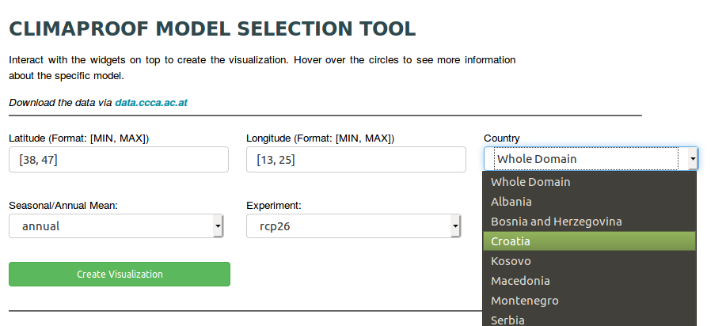
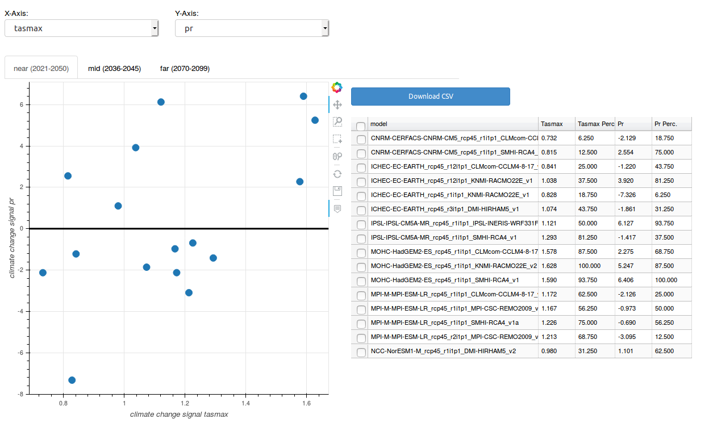

# Climaproof Toolbox

- TODO: 
  - Data projections

## Install Model Selection Tool
### Linux
#### Miniconda
- Download and install miniconda3
  Open a terminal:
  ```shell
  wget https://repo.anaconda.com/miniconda/Miniconda3-latest-Linux-x86_64.sh
  bash Miniconda3-latest-Linux-x86_64.sh
  conda env create -f environment_p36.yml
  conda activate p36
  ```

- Install Model Selection Tool/Downscaling Tool
  ```shell
  git clone https://github.com/sureL89/climaproof-tools.git
  cd climaproof-tools
  bokeh serve --show mst dst
  ```

#### Docker
- Install Docker
  <https://docs.docker.com/install/linux/docker-ce/ubuntu/>
  Add the user to the docker group. Afterwards you have to log out and in again.

- Install Model Selection Tool
  ```shell
  git clone https://github.com/sureL89/climaproof-tools.git
  cd climaproof-tools
  docker network create cproof
  docker build --rm --network=cproof -t climaproof/tools .
  docker run -t -i -p 5100:5100 climaproof/tools
  ```

- Open your Browser (e.g. Firefox) <http://127.0.0.1:5100/mst>
- Open your Browser (e.g. Firefox) <http://127.0.0.1:5100/dst>

### Windows
#### Miniconda

#### Docker
- Activate Virtualization in BIOS
- Install Docker
  <https://docs.docker.com/docker-for-windows/install/>
- Add the user to the docker group. Afterwards you have to log out and in again.

- Install Model Selection Tool
  - Download <https://github.com/sureL89/climaproof-tools/archive/master.zip>
  - Unzip it
  - Run following commands
    ```shell
    cd climaproof-tools
    docker network create cproof
    docker build --rm --network=cproof -t climaproof/tools .
    docker run -t -i -p 5100:5100 climaproof/tools
    ```

- Open your Browser (e.g. Firefox) <http://127.0.0.1:5100/mst>
- Open your Browser (e.g. Firefox) <http://127.0.0.1:5100/dst>


## Model Selection Tool in your Browser
- Choose the parameters:
  - Only bounding boxes supported so far
  - Latitude and Longitude are automatically updated if you choose a country

  

- After the calculation:
  - Near, mid and far future
  - Adapt axes and table
  - Export csv data for selected parameters
  - Export plot as png

  

